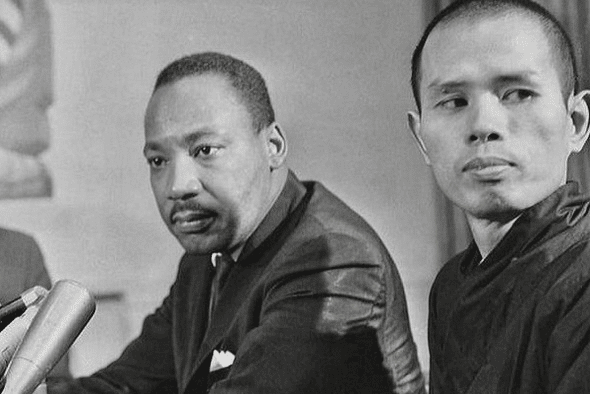

+++
date= 25-10-2024
menu= "post"
title = "Wat is geëngageerd boeddhisme?"
description = "We denken bij boeddhisme misschien aan zelfontwikkeling, mindfulness of meditatie. Maar wat gebeurt er als boeddhisten zich maatschappelijk inzetten?"
tags= [
		"Geëngageerd boeddhisme",
		"Activisme",
]
categories= ["Zen",
]
image = "../images/24_10_boeddhisme.png"
+++

# Wat is geëngageerd boeddhisme? 

Activisme associëren we niet zo snel met boeddhisme. Waar activisten de wereld in beweging willen brengen, lijken boeddhisten deze misschien juist tot stilte te manen. Ze mediteren, oefenen hun aandacht, en proberen zich niet te hechten aan dingen die veranderen. Zijn 'echte' activisten niet veel luidruchtiger, bozer, en misschien ook gewelddadiger dan dat? 

Toch is het een vooroordeel dat boeddhisten zich vooral naar binnen zou keren. Er bestaat namelijk zoiets als geëngageerd boeddhisme, dat zich hard maakt om de samenleving te verbeteren. De Vietnamese zenmonnik [Thich Nhat Hahn](https://en.wikipedia.org/wiki/Th%C3%ADch_Nh%E1%BA%A5t_H%E1%BA%A1nh) (op afbeelding boven post), bijvoorbeeld, zette zich zijn leven lang in voor vluchtelingen en het milieu. Hij beroept zich hierbij expliciet op belangrijke boeddhistisch teksten en overtuigingen, zoals zelfloosheid en verbondenheid met de wereld. 

Geëngageerd boeddhisme is inmiddels een gevestigde stroming, waarbij opgeroepen wordt tot een zacht verzet tegen onrecht. Het kan ons leren dat engagement kan samengaan met begrip voor onze tegenstanders. 

# Wat is geëngageerd boeddhisme? 

Wat is geëngageerd boeddhisme nu eigenlijk? Volgens religiewetenschapper [Paul Fuller](https://www.bloomsbury.com/us/introduction-to-engaged-buddhism-9781350129092/) (2022) is geëngageerd boeddhisme een vorm van boeddhisme die zich richt op politiek, de samenleving en het milieu. Net zoals alle boeddhisten proberen geëngageerde boeddhisten het lijden in de wereld op te lossen. Alleen denken zij niet dat we enkel lijden door onze eigen verlangens en overtuigingen, zoals traditionele boeddhisten dat denken, maar juist ook door de manier waarop de samenleving georganiseerd is. Het is duidelijk dat een corrupte overheid of een totalitair politiek systeem op grote schaal ellende veroorzaakt. Maar ook een samenleving als de onze, die ons aanmoedigt eindeloos te consumeren, kan ons op het verkeerde pad zetten, wanneer we ons overgeven aan verlangens die we nooit kunnen bevredigen. Geëngageerd boeddhisme zet zich daarom in voor een politieke verandering vanuit compassie, onthechting en verbondenheid die probeert de bronnen van leed te dempen.

De term 'geëngageerd boeddhisme' werd volgens religiewetenschapper Paul Fuller gepopulariseerd door Thich Nhat Hahn, die al in 1967 over '*engaged Buddhism*' sprak. Samen met anderen zette Nhat Hahn zich tijdens de Vietnamoorlog in voor slachtoffers aan beide kanten van het conflict. Toen hij na de oorlog verbannen werd uit Vietnam, bleef hij zich engageren voor bootvluchtelingen in de nasleep van de oorlog. In de decennia daarna riep Nhat Hahn ook regelmatig op tot verduurzaming van onze relatie tot de aarde. Vanuit zijn meditatiecentrum *Plum Village* in de Franse Dordogne combineerde hij daarmee de boeddhistische praktijk met een maatschappelijke missie. Nhat Hahn geloofde namelijk dat boeddhisme ons zou kunnen helpen om eerlijke onder ogen te komen hoe ons gedrag leed in stand houdt. Als we dankzij meditatie en andere oefeningen niet meer in de ban zijn van onze verlangens, durven we misschien pas echt te zien wat ons gedrag tot gevolgen heeft. Dan wordt ook duidelijk wat we kunnen veranderen aan ons zelf en aan onze omgeving.

# Wereldwijd activisme

Geëngageerd boeddhisme is een gevestigd fenomeen over de hele wereld. Zo is er bijvoorbeeld de [Sarvodaya Shramadana](https://www.sarvodaya.org/) beweging op Sri Lanka. Zij stellen dat verlichting niet alleen op persoonlijk niveau maar ook op het niveau van families, dorpen, steden, landen en zelfs de hele wereld kan plaatsvinden. Een ander bekende geëngageerd boeddhist uit Azië is B.R. Ambedkar (1891-1956). Ambedkar werd in India geboren in één van de laagste sociale kasten. Hij zette het boeddhisme in om het kastensysteem te bekritiseren, omdat hij niet geloofde dat vorige levens zouden kunnen bepalen welke plaats wij in de samenleving verdiend hebben. Deze bewegingen laten daarmee ook zien hoe traditionele boeddhistische thema's zoals wedergeboorte of verlichting een andere betekenis kunnen krijgen. 

In het Westen sluit deze vorm van boeddhisme vooral goed aan bij liberale en progressieve bewegingen die zich inzetten voor een rechtvaardige en inclusieve samenleving. De [Zen Peacemakers](https://zenpeacemakers.org/) werken bijvoorbeeld vanuit zenboeddhistische principes aan een betere wereld. Er zijn ook [groepen](https://gaybuddhist.org/) in de VS die pleiten voor een betere positie van queers in de boeddhistische wereld. Ook in Nederland bestaat er een groeiende interesse in geëngageerd boeddhisme. De [Zenpeacemakers](https://zenpeacemakers.nl) zijn bijvoorbeeld ook in Nederland actief, net zoals [meditatiegroepen](./https:/aandacht.net) in de lijn van Thich Nhat Hahn. Anderen zetten zich vanuit boeddhisme in voor daklozen, gevangenen, of verslaafden. Als je zelf eens geëngageerd boeddhisme in actie wilt zien, dan kun je in verschillende steden de Stille Actie van de Zenpeacemakers bijwonen. Iedere tweede zondag van de maand mediteren deelnemers samen op een publieke plaats, om in stilte te bezinnen op de klimaatcrisis.

Zelf wil ik ook nog verder uitzoeken hoe geëngageerd boeddhisme in theorie en praktijk werkt. Ik maak me erg druk om maatschappelijke problemen zoals racisme, de groeiende kloof tussen arm en rijk, en klimaatverandering. Maar helaas zijn zulke thema's splijtzwammen geworden in de samenleving. Verhitte discussies staan dialoog in de weg, en uiteindelijk lijkt iedereen zich in zijn eigen gelijk in te graven. Wat ik zo mooi vind aan het geëngageerd boeddhisme is dat het zoekt naar een andere weg: een weg van gesprek en gezamenlijke oplossingen, zelfs met schijnbare tegenstanders. Deze veelzijdige, wereldwijde stroming, die een middenweg zoekt tussen onthechting en actie, is daarom het verkennen waard.

