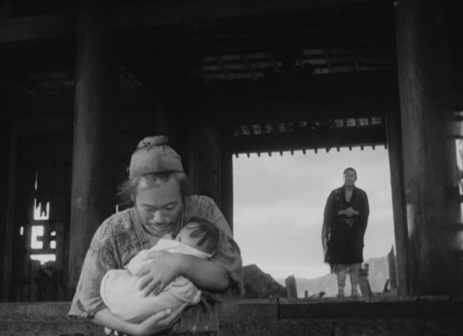

+++
date= 2024-11-26
menu= "post"
title = "Deze tijd is niet tragisch: ze is fragiel"
description = "Paul Ricoeur over fragiliteit"
tags= [
		"Ricoeur",
		"Politiek",
		"Hermeneutiek",
]
categories= ["Filosofie",
]
image = "../images/24_11_ricoeur.png"
+++

Steeds vaker zie ik goed bedoelende mensen de moed opgeven, omdat ze niet geloven dat verandering mogelijk is. Het lijkt alsof de geschiedenis al geschreven is, de democratie al zijn houdbaarheidsdatum bereikt heeft en de mens toch niets anders kan dan de planeet vernietigen. Als we zulke gedachten geloven, dan denken we dat we in een tragedie leven. In tragedies ligt namelijk al vast wat gaat gebeuren en alle pogingen aan het noodlot te ontsnappen, versnellen juist de komst van het onvermijdelijke ongeluk. Als onze geschiedenis een tragedie is, dan kunnen we dus inderdaad beter opgeven. 

Maar in het werk van Paul Ricoeur, waarover mijn proefschrift gaat, kwam ik laatst een spannende, andere visie tegen. Ricoeur denkt dat we onze tijd niet als tragisch maar vooral als fragiel moeten zien. Tragedies leren ons dat we moeten berusten in ons lot. Maar fragiliteit roept ons op tot verantwoordelijkheid. Als we nadenken over onze fragiele samenleving, dan zien we beter wat er op het spel staat; we moeten en kunnen het fragiele beschermen.

 Paul Ricoeur, [bron](https://tomjesse.com/).

# Niet tragisch, maar fragiel 

Voor een [lezing](https://journals.sagepub.com/doi/10.1177/0191453795021005-603) die Ricoeur in 1992 hield op uitnodiging van de AEPP (*Association des étudiants protestants de Paris*), werd hij gevraagd te reflecteren op de betekenis van de geschiedenis in tragische tijden. Geloven we nog in historische vooruitgang, zelfs na de grote tragedies van de vorige eeuw? Ricoeur antwoordt dat we beter kunnen spreken over fragiliteit dan over tragedies, alhoewel de twee termen veel met elkaar gemeen hebben. 

Het tragische en het fragiele gaan namelijk allebei over waardige mensen, mensen die onze respect verdienen. Zo wees Aristoteles er al op dat tragedies het beste zijn als ze gaan over mensen naar wie we kunnen opkijken. Dat wat fragiel is mag niet zomaar vernietigd worden. Als we zien hoe een fragiel ecosysteem ineenstort, dan zullen we het gevoel hebben dat dit niet had moeten gebeuren: het fragiele is het waard om beschermd te worden. Maar er zijn volgens Ricoeur ook belangrijke verschillen. In een tragedie kan een hoofdpersoon niets doen om te ontsnappen aan zijn lot. Hoewel hij probeert zijn situatie te verbeteren, zorgt dat er juist voor dat hij zijn eigen ondergang voorbereidt. De uitkomst van een fragiele situatie ligt daarentegen nog niet vast. 

 Aan het einde van de film *Rashomon* van Akira Kurosawa neemt een houthakker verantwoordelijkheid over een vondeling. Na het gewelddadige plot, dat cynisme aanmoedigt, laat Kurosawa op deze manier zien dat de mens ook in staat is een ander pad te lopen. 

Sterker nog, dat wat fragiel is roept ons op om iets te doen. Fragiliteit vraagt daarbij om zorg maar ook om liefde. Als we een pasgeboren baby zien die aan zijn lot is overgelaten, dan weten we meteen dat we moeten handelen. We willen het fragiele helpen om te overleven, maar ook om het een waardig leven te geven waarin het kan opbloeien. Ricoeur wijst erop dat het fragiele ons dus verantwoordelijk maakt. "Door op mij te rekenen," schrijft Ricoeur, "maakt de ander mij verantwoordelijk voor mijn acties." 

Dit lijkt misschien filosofisch geneuzel over definities. Maar het maakt een groot verschil of iets als tragisch of als fragiel zien. Als we bijvoorbeeld zeggen dat de oorlog in Oekraïne tragisch is, dan kan dat betekenen dat we deze vreselijke strijd zien als de uitkomst van grote historische krachten waarop niemand controle heeft. Als we zeggen dat Oekraïne strijdlustig maar fragiel is, dan is dit een oproep om het land te steunen in een oorlog waarvan de uitkomst nog niet vastligt. Het tragische vraagt om berusting, het fragiele om actie.

## Fragiele verantwoordelijkheid

In zijn lezing zegt Ricoeur dat alle samenlevingen fragiel zijn, omdat fragiliteit bij politieke macht hoort. Dat betekent dus ook dat we als politieke wezens telkens verantwoordelijk zijn om te reageren op deze fragiliteit. Hoe komen we fragiliteit en verantwoordelijkheid tegen in de politiek?

Een belangrijke bron van politieke fragiliteit is, volgens Ricoeur, de spanning in alle samenlevingen tussen de horizontale en verticale aspecten van macht. Verticale machtsrelaties gaan over de macht die autoriteiten, zoals de wet en de politie, over ons hebben. Deze komen als het ware 'van bovenaf'. Maar er zijn ook belangrijke horizontale relaties in een samenleving. Daarmee bedoelt Ricoeur de relaties tussen burgers onderling, als gelijken. In een gezonde democratie is de verticale macht van bovenaf gebaseerd op een respect voor de horizontale relaties tussen burgers. De macht van bovenaf is namelijk alleen democratisch als deze vanuit de burgers zelf komt. Dit spanningsveld kan op twee manieren verstoord worden. 

 Tijdens de *Black Lives Matter* protesten in de VS werd de legitimiteit van de politie in twijfel getrokken na de gewelddadige dood van George Flyod tijdens een arrestatie. [Bron](https://unsplash.com/photos/white-and-black-ford-mustang-on-road-during-night-time-68ENNHTb4iI).

Ten eerste kan een staat macht kan uitoefenen op een samenleving die deze macht niet langer rechtvaardig vindt. Dit gebeurt bijvoorbeeld wanneer een dictator de macht grijpt en zijn wil aan het volk oplegt. Het kan ook gebeuren als het volk niet meer gelooft in de democratische instituten en al het vertrouwen in de politiek kwijt is. Maar, ten tweede, kunnen burgers ook vergeten dat de samenleving gebouwd is op de wil om samen te leven. In dat geval is er geen 'horizontale' relatie meer tussen de burgers en ontrafelt de maatschappij. Ricoeur wijst erop dat we deze wil om samen te leven vaak pas ontdekken als het te laat is, wanneer een samenleving verslagen is en "alles uiteenvalt".

Als burgers moeten we op twee manieren reageren op deze fragiliteit van de samenleving. Samen met wetenschappers en denkers moeten we volgens Ricoeur de macht van de staat controleren en zo op het rechtvaardige pad houden. Nog belangrijker is dat burgers inzien dat de wil om samen te leven kwetsbaar is en dat ze deze beschermen. Als we niet meer naar elkaar omkijken, is er geen samen-leving meer. 

# Tragische sprookjes 

We kunnen van Ricoeur leren dat het fragiele geen boodschap heeft aan tragisch doemdenken. Het fragiele accepteert simpelweg niet dat het te laat is. En in de praktijk geloven wij dat misschien ook wel niet. Hoewel we niet weten wat de toekomst brengt, zullen we voor onze pasgeboren kinderen blijven zorgen. Hoewel we niet weten hoe lang onze democratie nog overeind staat, zullen we iets willen doen als we luisteren naar de wanhopige stemmen van iedereen die lijdt aan onrecht. Zelfs als het te laat is, kijkt het fragiele vol hoop naar ons op. Zelfs als het te laat is, is het dus niet te laat om iets te doen. 

In Nederland leven we helaas in een tijd waarin de verticale macht, de staat, zich actief inspant om burgers te verdelen. Zoals we weten hebben leden uit het kabinet hebben in de nasleep van geweld in Amsterdam uitspraken gedaan die bepaalde groepen Nederlanders discrimineren. Hier zien we dus dat de verticale macht gebruikt wordt om de gemeenschappelijke wil tot samenleven onder druk te zetten. Hoewel het kabinet zal zeggen dat het Nederland probeert te beschermen, vergroot het juist de fragiliteit van onze samenleving.

Als we zien hoe fragiel onze samenleving is, dan is het niet meer genoeg om in tragische sprookjes te geloven waarin het einde vastligt. Opgeven is een decadentie waarmee het fragiele ons niet laat wegkomen. 
